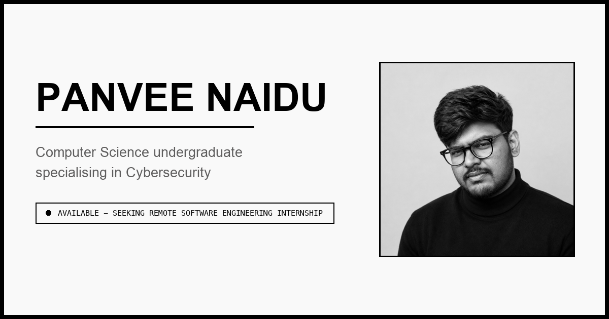

# Panvee Naidu — Portfolio

Personal portfolio site. Static, dependency-free at runtime, deployed on Vercel.

**Live:** https://panveedev.vercel.app



---

## About

The site ships **two complete designs**, not one design recoloured:

- **Light — "Obsidian Mono."** Pure black on off-white, zero border-radius, monospace labels,
  heavy 2px rules.
- **Dark — "Editorial Teal."** Warm near-black, bone text, Libre Caslon Display headings against
  JetBrains Mono labels, hairline rules, teal accent.

Each carries its own markup and its own motion runtime. A single `data-theme` attribute on `<html>`
switches between them, set before first paint so the page never flashes the wrong design. It covers
featured projects, technical skills, experience, education, and verifiable certifications, plus six
long-form project case studies.

## Tech

| | |
|---|---|
| Markup | Semantic HTML5 |
| Styling | Tailwind CSS 3 (compiled, not CDN) + hand-written CSS per theme |
| Scripting | Vanilla JS — no framework, no bundler |
| Animation | [anime.js](https://animejs.com) v4 (vendored) for the light design; hand-rolled runtime for dark |
| Background | WebGL fragment shader (interactive dot grid) |
| Hosting | Vercel (static, no build step) |

**One runtime dependency:** anime.js v4, vendored in `vendor/` rather than loaded from a CDN so the
page owns its dependency. It adds ~40 KB gzipped and is the largest script on the site.

## Features

- **Two full designs** with a persisted preference, following the OS until you choose for yourself
- **Cross-fade theme switch** — the views are separate DOM trees, so the swap happens behind a
  cover rather than as a visible cut
- **Standing theme indicator** that points at the toggle and stands down once you scroll in
- **Scroll-spy navigation** — an underline slides between sections, driven by section geometry
- **WebGL dot-grid background** that reacts to cursor position
- **Animated statistics** — figures spin up out of noise and decelerate onto their real value
- **Chained case studies** — every project page links to the next, so you can walk the whole set
  without returning to the index
- **Contact form** that composes a prefilled `mailto:` — no backend, no third-party form service
- **Respects `prefers-reduced-motion`** — every animation is guarded, in both designs
- **Social share card** with Open Graph and Twitter meta

## Performance

| | Before | After |
|---|---|---|
| Page weight | ~2,350 KB | **~243 KB** |
| CSS | ~400 KB (CDN, runtime-compiled) | **20 KB** (prebuilt, minified) |
| Hero image | 1.81 MB PNG | **174 KB** JPEG |

Figures are from the original single-design build. The second design and anime.js have since added
roughly 40 KB gzipped of script on top.

## Running locally

```bash
git clone https://github.com/panvenaidu/Portfolio.git
cd Portfolio
python3 -m http.server 8000   # then open http://localhost:8000
```

> **Caching gotcha.** `python3 -m http.server` sends no cache directives, so browsers
> heuristically cache `.css` and `.js` and keep serving stale copies after an edit — changes
> appear not to apply. Hard-reload (<kbd>⇧</kbd>+<kbd>⌘</kbd>+<kbd>R</kbd>), use a private
> window, or serve with `Cache-Control: no-store` while developing.

## Editing styles

`styles.css` is generated — do not edit it directly. Change classes in `index.html` or tokens in
`tailwind.config.js`, then rebuild:

```bash
npm install
npx tailwindcss -c tailwind.config.js -i src/input.css -o styles.css --minify
```

The design tokens (colours, spacing, type scale) live in `tailwind.config.js` and are the source
of truth for the whole design system.

## Deploying

```bash
vercel deploy --prod
```

`.vercelignore` keeps build tooling off the server, so Vercel serves pure static output and never
runs a build step.

## Structure

```
index.html            Both designs — the light and dark views live side by side
styles.css            Compiled Tailwind output (generated)
dark.css              Dark design + the shared theme toggle and indicator
theme.js              Theme engine — switching, persistence, cross-fade
dark.js               Dark-design motion runtime (reveals, counters, parallax)
motion.js             anime.js effects for the light design
vendor/               anime.js v4, vendored (MIT)
tailwind.config.js    Design tokens
src/input.css         Tailwind entry point
projects/             Six case studies, each linking on to the next
profile.jpg           Hero portrait
og.png                Social share card
Panvee_Naidu_Resume.pdf
Certs/                Certificates linked from the site
```

## Contact

- **Email** — panveenaidu5@gmail.com
- **LinkedIn** — [panvee-naidu](https://www.linkedin.com/in/panvee-naidu-8a6430291/)

## License

[MIT](LICENSE) for the code. The résumé, certificates, and photograph are personal content and are
not covered by that licence — please don't reuse them.
